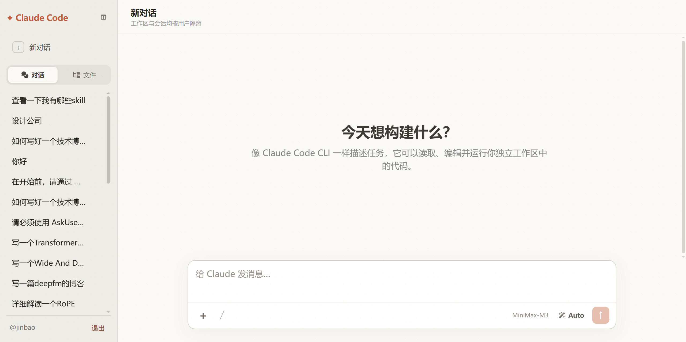

<h1 align="center">Claude Code UI</h1>

<p align="center">
  <a href="README.md">简体中文</a> · <strong>English</strong>
</p>

<p align="center">
  A multi-user Claude Code web client for teams and individuals<br />
  Bring the Claude Code CLI and VS Code extension experience to your browser
</p>

<p align="center">
  
  
  
  
</p>



Claude Code UI is a multi-user web interface built with React, Express, SQLite, and the Claude Code CLI. In addition to final answers, it streams the full execution process—including Thinking, Read, Bash, Agent, and Skill events—while isolating sessions, messages, and workspaces for every user.

## Why Claude Code UI

- **Authentic Claude Code experience:** Drives the local Claude Code CLI directly with resumable sessions, tool calls, and execution modes.
- **Transparent execution:** Displays Thinking, tool descriptions, inputs, and outputs separately without mixing tool narration into the final answer.
- **Multi-user isolation:** Every user has an independent identity, chat history, CLI session, and workspace directory.
- **Designed for real work:** Supports streaming, stop and retry controls, attachments, file references, Markdown, MathJax, and responsive layouts.
- **Addressable sessions:** Every conversation has its own URL and survives refreshes and browser history navigation.

## Features

### Chat and agent execution

- Real-time NDJSON streaming with force-stop support while preserving generated content.
- Narration emitted before a tool call appears before that tool. Intermediate sub-agent text is also included in the conversation stream. Thinking, Read, Write, Edit, Bash, Skill, and tool results are shown in execution order.
- Tool cards show file paths or Bash descriptions directly, with collapsible `IN` and `OUT` details.
- Text from tool-use turns is classified as execution progress; only the confirmed final answer is saved as assistant content.
- A Submit answer panel appears above the composer when Claude needs structured user input.
- Responses include copy, retry, elapsed-time, and input/output/cache token controls.
- Interrupted sessions can resume with “continue” without returning `No response requested.`

### Composer and content

- Markdown, GFM, automatic code syntax highlighting, and MathJax formula rendering.
- Four execution modes: `Auto`, `Plan`, `Manual`, and `Edit automatically`.
- The `/` menu dynamically discovers Commands and Skills from Claude CLI, user configuration, plugins, and the workspace, including their real descriptions.
- Use `@` to search for and reference files in the current user's workspace.
- Upload attachments by selecting, dragging, or pasting screenshots. Each message supports up to 10 files, with a 500MB limit per file.
- Press `Enter` to send, or `Ctrl+Enter` / `Shift+Enter` to insert a line break.

### Sessions and workspace

- Register and sign in with email, username, and password; passwords are stored as bcrypt hashes.
- Sessions, messages, attachments, and workspaces are isolated between users.
- Session URLs use `/sessions/:sessionId` and support refresh recovery and History API navigation.
- A new conversation is added to history only after real content is sent.
- The sidebar switches between chat history and files, and supports resizing, collapsing, and reopening.
- Clicking a file opens a VS Code-style center workspace. CodeMirror provides syntax highlighting, line numbers, bracket matching, folding, and completion based on file type. Multiple tabs, unsaved-state indicators, tab closing, button save, and `Ctrl/Cmd+S` are supported. The workspace collapses automatically when no file is open.
- The workspace/chat divider is resizable. File context menus support Open, Rename, Delete, Cut, Copy, Paste, Download, and New File. Deleting a folder recursively removes all descendants and closes editor tabs from that directory.
- Rename, New File, and New Folder use inline editors with visible save/cancel controls, `Enter` to confirm, and `Esc` to cancel. Rename has an independent state and endpoint; failures preserve the entered name and appear inline.
- Cut/Copy state is visible on the source file. Paste refreshes the tree and Cut updates open-tab paths. Dropping external files onto a folder uploads to that folder; dropping onto a file uses its parent; dropping onto empty space uses the workspace root.
- The effective Claude working directory is `<WORKSPACE_DIR>/<username>`.

### Responsive experience

Desktop layouts include full session history, files, a resizable sidebar, workspace, and chat. Mobile layouts use a top navigation bar, a drawer for session history, and a safe-area-aware bottom composer.

<p align="center">
  
</p>

## Architecture

| Layer          | Technology                                              |
| -------------- | ------------------------------------------------------- |
| Web            | React, TypeScript, Vite, CodeMirror, Font Awesome       |
| API            | Express, TypeScript, Zod, Multer                        |
| Data           | SQLite, better-sqlite3                                  |
| Authentication | JWT HttpOnly cookies, bcrypt                            |
| AI runtime     | Claude Code CLI, `stream-json`, MCP                     |
| Rendering      | react-markdown, remark-gfm, remark-math, rehype-mathjax |

```text
Browser
  ├── React UI ─────────────── NDJSON stream ──────────────┐
  └── HttpOnly session cookie                              │
                                                          ▼
Express API ── SQLite (users / sessions / messages) ── Claude Code CLI
     │                                                     │
     └── <WORKSPACE_DIR>/<username> ◀── Read / Edit / Bash ┘
```

## Quick start

### Requirements

- Node.js 20 or later
- npm
- An installed and authenticated Claude Code CLI

Verify that the CLI works first:

```bash
claude --version
claude
```

### Install and run

```bash
git clone https://github.com/JinbaoSite/claude-code-ui.git
cd claude-code-ui
npm install
cp .env.example .env
npm run dev
```

Default endpoints:

- Web UI: <http://localhost:5173>
- API: <http://localhost:3001>

In development, Vite proxies `/api` to Express. Register an account on first launch to get started.

## Configuration

```dotenv
PORT=3001
WEB_PORT=5173
JWT_SECRET=replace-with-at-least-32-random-characters
CLAUDE_CLI_PATH=claude
CLAUDE_ALLOWED_TOOLS=Bash
WORKSPACE_DIR=/absolute/path/to/workspaces
# CLAUDE_MODEL=sonnet
# DATA_DIR=data
```

| Variable               | Description                                         | Default                 |
| ---------------------- | --------------------------------------------------- | ----------------------- |
| `PORT`                 | Express API port                                    | `3001`                  |
| `WEB_PORT`             | Vite Web UI port                                    | `5173`                  |
| `JWT_SECRET`           | JWT secret; use a strong random value in production | Development placeholder |
| `CLAUDE_CLI_PATH`      | Claude CLI command or absolute path                 | `claude`                |
| `CLAUDE_ALLOWED_TOOLS` | Claude tools allowed automatically                  | `Bash`                  |
| `WORKSPACE_DIR`        | Root directory for all user workspaces              | `<DATA_DIR>/workspaces` |
| `CLAUDE_MODEL`         | Optional fixed Claude model                         | CLI default             |
| `DATA_DIR`             | Directory for SQLite and default workspaces         | `data`                  |

Changing `WORKSPACE_DIR` does not migrate existing data. Stop the service, move the old workspaces, and ensure that the operating-system account running the service has read/write access.

## Production deployment

```bash
npm run build
NODE_ENV=production npm start
```

In production, Express serves both the `dist` assets and the API. A reverse proxy such as Nginx or Caddy is recommended:

- Enable HTTPS. Production cookies use `Secure` and are not sent over plain HTTP.
- Configure request-size and timeout limits for uploads up to 500MB.
- Disable proxy buffering for streaming responses.
- Persist and back up the database and user workspaces.

## Data and sessions

Default structure:

```text
data/
├── app.db
├── app.db-shm
├── app.db-wal
└── workspaces/
    └── <username>/
        └── uploads/
```

The database relationship is `users → sessions → messages`. Every session and message query validates the current user. Each web session also maps to an independent Claude CLI session ID: the first turn uses `--session-id`, and later turns use `--resume`.

When `CLAUDE_MODEL` is unset, startup performs a lightweight probe without tools or session persistence and reads the actual model from the Claude CLI initialization event. If the probe fails or times out, the UI shows `CLI default`; normal conversations still update the model from runtime events.

The workspace editor reads files through `GET /api/workspace/file?path=...` and saves with `PUT /api/workspace/file`. File management uses `/api/workspace/entry`, `/api/workspace/rename`, `/api/workspace/paste`, and `/api/workspace/download`. These endpoints accept only paths within the current user's workspace. Online editing is limited to 5MB; attachment and file-tree uploads allow up to 500MB per file.

## Streaming events

`POST /api/sessions/:id/messages` returns `application/x-ndjson`:

| Event            | Purpose                                                          |
| ---------------- | ---------------------------------------------------------------- |
| `delta`          | Append text to the current candidate answer                      |
| `replace_answer` | Remove tool-turn narration and retain the confirmed final answer |
| `activity`       | Thinking, tool calls, and tool results                           |
| `question`       | Request structured answers from the user                         |
| `model`          | Current model reported by the CLI                                |
| `metrics`        | Duration and input/output/cache token metrics                    |
| `done` / `error` | Normal or abnormal stream completion                             |

## Development

```bash
npm run dev          # Start Web and API together
npm run dev:web      # Start Vite only
npm run dev:server   # Start Express only
npm test             # Run Node tests
npm run build        # Type-check and build the frontend
npm start            # Start the production server
```

Key directories:

```text
src/                 React UI, message rendering, composer, and responsive styles
server/              Authentication, SQLite, uploads, Claude CLI, and stream parsing
docs/images/         README product screenshots
data/                Local database and default user workspaces (generated at runtime)
Agent.md             Implementation constraints and verification checklist for agents
```

Before committing changes, run at least:

```bash
npm test
npm run build
```

For UI changes, also verify authentication, session switching, message sending, sidebar/drawer behavior, and the composer at desktop and approximately `390 × 844` mobile viewports.

## Security boundary

The current multi-user implementation provides **application-level data and directory isolation**, not an operating-system sandbox. Claude Code's Bash tool may access other paths readable by the operating-system account running the service.

For public or untrusted-user deployments, add:

- A separate container or microVM per user
- HTTPS, CSRF protection, rate limiting, and login abuse prevention
- Command, filesystem-path, and network access policies
- Upload scanning, disk quotas, and expiration cleanup
- Audit logs, log rotation, and database backups

## Project status

This project is evolving quickly. APIs, database schemas, and UI behavior may continue to change. Back up `DATA_DIR` and `WORKSPACE_DIR` before upgrading.
