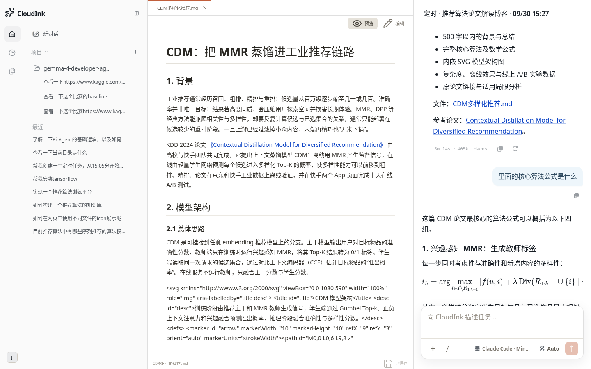
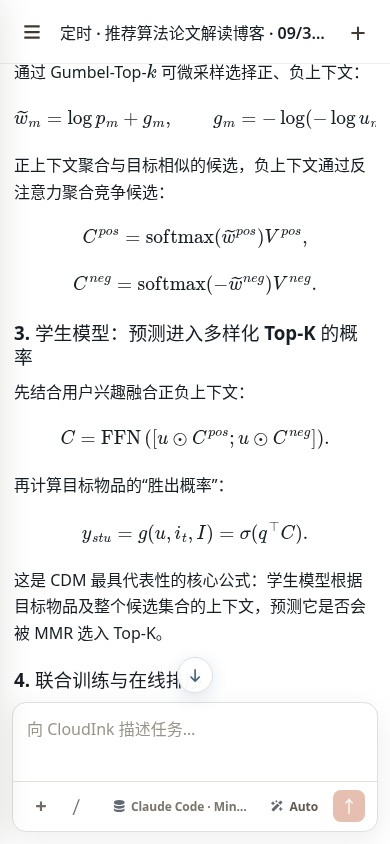

<h1 align="center">CloudInk</h1>

<p align="center">
  <a href="README.md">简体中文</a> · <strong>English</strong>
</p>

<p align="center">
  A multi-user AI agent workspace for teams and individuals<br />
  Use Claude Code, Codex, projects, schedules, and a file editor from one browser UI
</p>

<p align="center">
  
  
  
  
</p>



CloudInk is a multi-user AI workspace built with React, Express, SQLite, the Claude Code CLI, and the Codex CLI. In addition to final answers, it presents Thinking, WebSearch, Read, Bash, Agent, and Skill events in their real execution order while isolating sessions, messages, projects, and workspaces for every user.

## Why CloudInk

- **Two agent backends:** Drives the local Claude Code CLI or Codex CLI directly, with selectable backends and real configured models in the composer.
- **Transparent execution:** Displays Thinking, tool descriptions, inputs, and outputs separately without mixing tool narration into the final answer.
- **Multi-user isolation:** Every user has an independent identity, chat history, CLI session, and workspace directory.
- **Projects and automation:** Projects have dedicated directories and conversations; scheduled tasks retain their backend, model, cron, timezone, overlap policy, and run history.
- **Designed for real work:** Supports streaming, stop and retry controls, attachments, file references, Markdown, MathJax, and responsive layouts.
- **Addressable sessions:** Every conversation has its own URL and survives refreshes and browser history navigation.

## Features

| Capability                | Description                                                                                                                               |
| ------------------------- | ----------------------------------------------------------------------------------------------------------------------------------------- |
| Multi-backend agent chat  | Claude Code and Codex with backend-specific models, Commands/Skills, Thinking, Agent, and complete tool execution.                        |
| Professional composer     | Backend/model selection, execution modes, dynamic Commands/Skills, `@` references, 500MB attachments, drag-and-drop, and multiline input. |
| Recoverable sessions      | Addressable session URLs with refresh recovery, favorites, deletion, stop, continue, copy, and retry controls.                            |
| Project management        | Create, edit, pin, and delete projects; bind each project to a directory and create, expand, or move project conversations.               |
| Scheduled tasks           | Cron, timezone, Claude/Codex, model, execution mode, and overlap policy, with every run available as a separate chat.                     |
| VS Code-style workspace   | A collaborative sidebar, file tree, multi-tab editor, and Chat layout with syntax highlighting, save state, and resizable panes.          |
| Markdown and HTML preview | GFM, syntax highlighting, and MathJax for Markdown; sandboxed live HTML preview with relative CSS, JavaScript, image, and font assets.    |
| Complete file management  | Create, rename, recursive folder deletion, cut, copy, paste, download, and directory-aware drag-and-drop upload.                          |
| Static site publishing    | Publish one HTML file or a complete folder site containing `index.html` through a tokenized public URL.                                   |
| Desktop and mobile        | Resizable three-pane desktop layout with a compact icon rail, plus mobile navigation, history drawer, and safe-area-aware composer.       |

### Chat and agent execution

- Real-time NDJSON streaming with force-stop support while preserving generated content.
- Progress narration appears before its corresponding tool. Thinking, WebSearch, Read, Write, Edit, Bash, Skill, and tool results remain in their real execution order for both Claude Code and Codex.
- Tool cards show file paths or Bash descriptions directly, with collapsible `IN` and `OUT` details.
- Text from tool-use turns is classified as execution progress; only the confirmed final answer is saved as assistant content.
- A Submit answer panel appears above the composer when Claude needs structured user input.
- Responses include copy, retry, elapsed-time, and input/output/cache token controls.
- Interrupted sessions can resume with “continue” without returning `No response requested.`
- Refreshing a running session restores its Working indicator and incrementally fetches new activities and the final response; refreshing the browser does not abort the CLI process.

### Composer and content

- Markdown, GFM, automatic code syntax highlighting, and MathJax formula rendering.
- Four execution modes: `Auto`, `Plan`, `Manual`, and `Edit automatically`.
- Select Claude Code or Codex and its real configured model from the composer. Claude models come from CLI initialization; Codex models come from `models_cache.json`, `config.toml`, or server configuration.
- The `/` menu discovers Commands and Skills for the active backend from CLI, user, plugin, and workspace configuration, including their real descriptions.
- Use `@` to search for and reference files in the current user's workspace.
- The `/` and `@` suggestion menus support cyclic Up/Down selection, `Enter` to confirm, and `Esc` to close; the active item scrolls into view automatically.
- Upload attachments by selecting, dragging, or pasting screenshots. New attachments are saved directly in the current user's workspace root. Each message supports up to 10 files, with a 500MB limit per file.
- Press `Enter` to send, or `Ctrl+Enter` / `Shift+Enter` to insert a line break.

### Sessions and workspace

- Submit a registration request with email, username, and password. Root must approve it from sidebar Messages before sign-in; Messages permanently retains pending, approved, and rejected records with their review times. Users can then sign in with either username or email, and passwords are stored as bcrypt hashes.
- Sessions, messages, attachments, and workspaces are isolated between users.
- Session URLs use `/sessions/:sessionId` and support refresh recovery and History API navigation.
- Conversation history supports pinning favorites, removing favorites, and deletion. Favorite state is persisted per user across refreshes and sign-ins.
- A new conversation is added to history only after real content is sent.
- The left icon rail contains Home, Scheduled tasks, and Files, with the account icon at the bottom. Home contains New conversation, Projects, and Recent. The content sidebar is resizable; collapsing it keeps the 56px icon rail, while mobile uses a drawer.
- New conversation at the top creates a root-workspace chat. A new conversation inside a project uses that project's directory. Existing chats remain unassigned until explicitly moved to a project.
- Projects can be created, edited, pinned, or deleted and can bind an existing or new directory. Project chats support whole-row switching, rename, favorite, move, and delete actions.
- Clicking a file opens a VS Code-style center workspace. CodeMirror provides syntax highlighting, line numbers, bracket matching, folding, and completion based on file type. Multiple tabs, unsaved-state indicators, tab closing, button save, and `Ctrl/Cmd+S` are supported. Markdown files can switch between rendered preview and source editing, with GFM, syntax highlighting, and MathJax in preview mode. HTML files also support sandboxed preview and source editing, including relative CSS, JavaScript, image, and font assets from the workspace. The workspace collapses automatically when no file is open.
- On first opening the workspace on desktop, Sidebar, Workspace, and Chat use a `25% / 45% / 30%` width split. The dividers remain draggable, and double-clicking one restores its default ratio. File context menus support Open, Rename, Delete, Cut, Copy, Paste, Download, and New File. Deleting a folder recursively removes all descendants and closes editor tabs from that directory.
- Relative workspace paths and CloudInk absolute workspace paths in agent responses open directly in the center Workspace. External links such as `http(s)` continue to behave as normal web links.
- Rename, New File, and New Folder use inline editors with visible save/cancel controls, `Enter` to confirm, and `Esc` to cancel. Rename has an independent state and endpoint; failures preserve the entered name and appear inline.
- Cut/Copy state is visible on the source file. Paste refreshes the tree and Cut updates open-tab paths. Dropping external files onto a folder uploads to that folder; dropping onto a file uses its parent; dropping onto empty space uses the workspace root.
- HTML files can be published as public webpages from the context menu. A folder containing `index.html` can also be published as a complete static site; HTML, CSS, JavaScript, images, and fonts remain available at their original relative paths. Single pages use `/<username>/published/<page.html>?token=<token>`, while folder homepages use `/<username>/published/<folder>/?token=<token>` without exposing `index.html` in the URL. Published pages can be opened, copied, or unpublished and run in a browser sandbox isolated from the signed-in UI.
- Root conversations run in `<WORKSPACE_DIR>/<username>`; project conversations run in the project's bound directory.

### Scheduled tasks

- Tasks use five-field cron expressions and IANA timezones such as `Asia/Shanghai`.
- Each task stores its Claude Code or Codex backend, model, execution mode, and skip-or-queue overlap policy.
- CloudInk runs tasks in the background. Every run creates a dedicated conversation containing the prompt, Thinking, tool calls, and final response.
- Tasks can run immediately or be enabled, paused, edited, and deleted. Deleting a task also removes its run history and associated scheduled conversations.
- Claude Code can create and manage the same tasks through CloudInk's built-in MCP tools, so natural-language and page-based task management share one data source.

### Responsive experience

Desktop layouts include full session history, files, a resizable sidebar, workspace, and chat. Mobile layouts use a top navigation bar, a drawer for session history, and a safe-area-aware bottom composer.

<p align="center">
  
</p>

## Architecture

| Layer          | Technology                                              |
| -------------- | ------------------------------------------------------- |
| Web            | React, TypeScript, Vite, CodeMirror, Font Awesome       |
| API            | Express, TypeScript, Zod, Multer                        |
| Data           | SQLite, better-sqlite3                                  |
| Authentication | JWT HttpOnly cookies, bcrypt                            |
| AI runtime     | Claude Code CLI, Codex CLI, `stream-json` / JSONL, MCP  |
| Rendering      | react-markdown, remark-gfm, remark-math, rehype-mathjax |

```text
Browser
  ├── React UI ─────────────── NDJSON stream ──────────────┐
  └── HttpOnly session cookie                              │
                                                          ▼
Express API ── SQLite (users / projects / sessions / tasks / messages)
     │                                      │
     │                                      ├── Claude Code CLI
     │                                      └── Codex CLI
     └── <WORKSPACE_DIR>/<username> ◀── Read / Edit / Bash
```

## Quick start

### Requirements

- Node.js 20 or later
- npm
- At least one installed and authenticated Claude Code CLI or Codex CLI

Verify that the CLI works first:

```bash
claude --version
claude

# When using Codex
codex --version
codex
```

### Install and run

```bash
git clone https://github.com/JinbaoSite/CloudInk.git
cd CloudInk
npm install
cp .env.example .env
npm run dev
```

Default endpoints:

- Web UI: <http://localhost:5173> (or the configured `WEB_PORT`)
- API: <http://localhost:3001>

In development, Vite proxies `/api` to Express. Register an account on first launch to get started.

## Configuration

```dotenv
PORT=3001
WEB_PORT=5173
COOKIE_SECURE=false
APP_NAME=CloudInk
ROOT_EMAIL=root@cloudink.com
ROOT_PASSWORD=replace-with-a-strong-root-password
JWT_SECRET=replace-with-at-least-32-random-characters
CLAUDE_CLI_PATH=claude
CLAUDE_ALLOWED_TOOLS=Bash
CODEX_CLI_PATH=codex
WORKSPACE_DIR=/absolute/path/to/workspaces
# CLAUDE_MODEL=sonnet
# CODEX_MODEL=<model-id>
# SCHEDULED_TASK_CONCURRENCY=2
# DATA_DIR=data
```

| Variable                     | Description                                         | Default                 |
| ---------------------------- | --------------------------------------------------- | ----------------------- |
| `PORT`                       | Express API port                                    | `3001`                  |
| `WEB_PORT`                   | Vite Web UI port                                    | `80` (example: `5173`)  |
| `COOKIE_SECURE`              | Send the login cookie over HTTPS only               | `false`                 |
| `APP_NAME`                   | Brand shown on login, sidebar, and browser title    | `CloudInk`              |
| `ROOT_EMAIL`                 | Root administrator sign-in email                    | `root@cloudink.local`   |
| `ROOT_PASSWORD`              | Strong password used for initial Root creation      | Root is not created     |
| `JWT_SECRET`                 | JWT secret; use a strong random value in production | Development placeholder |
| `CLAUDE_CLI_PATH`            | Claude CLI command or absolute path                 | `claude`                |
| `CLAUDE_ALLOWED_TOOLS`       | Claude tools allowed automatically                  | `Bash`                  |
| `WORKSPACE_DIR`              | Root directory for all user workspaces              | `<DATA_DIR>/workspaces` |
| `CLAUDE_MODEL`               | Optional fixed Claude model                         | CLI default             |
| `CODEX_CLI_PATH`             | Codex CLI command or absolute path                  | `codex`                 |
| `CODEX_MODEL`                | Optional fixed Codex model                          | Codex configuration     |
| `CODEX_HOME`                 | Codex configuration and model-cache directory       | `~/.codex`              |
| `SCHEDULED_TASK_CONCURRENCY` | Maximum concurrent scheduled runs                   | `2`                     |
| `DATA_DIR`                   | Directory for SQLite and default workspaces         | `data`                  |

Changing `WORKSPACE_DIR` does not migrate existing data. Stop the service, move the old workspaces, and ensure that the operating-system account running the service has read/write access.

When `ROOT_PASSWORD` is configured, the service creates the reserved `root` username. The password is used only for initial creation and can then be changed persistently from the sidebar account menu; `ROOT_EMAIL` is still synchronized at startup. Root can browse all conversations grouped by username and access every workspace through top-level user folders; other users' conversations are read-only. Never commit the real Root password.

## Production deployment

```bash
npm run build
NODE_ENV=production npm start
```

In production, Express serves both the `dist` assets and the API. A reverse proxy such as Nginx or Caddy is recommended:

- Enable HTTPS. Production cookies use `Secure` and are not sent over plain HTTP.
- Configure request-size and timeout limits for uploads up to 500MB.
- Disable proxy buffering for streaming responses.
- Persist and back up the database and user workspaces.

## Data and sessions

Default structure:

```text
data/
├── app.db
├── app.db-shm
├── app.db-wal
└── workspaces/
    └── <username>/
        └── <uploaded-files>
```

The database stores users, projects, sessions, messages, scheduled tasks, and scheduled task runs. Every project, task, session, and message query validates the current user. Claude Code conversations resume through their session IDs; Codex conversations persist a thread ID and resume the same thread on later turns.

When `CLAUDE_MODEL` is unset, CloudInk performs a lightweight probe without tools or session persistence and reads the actual model from the Claude CLI initialization event. Codex model choices are loaded from `CODEX_MODEL`, `$CODEX_HOME/config.toml`, and `models_cache.json`; the UI keeps each backend's model list separate.

The workspace editor reads files through `GET /api/workspace/file?path=...` and saves with `PUT /api/workspace/file`. File management uses `/api/workspace/entry`, `/api/workspace/rename`, `/api/workspace/paste`, and `/api/workspace/download`. These endpoints accept only paths within the current user's workspace. Online editing is limited to 5MB. Chat attachments are written directly to the workspace root, while file-tree uploads use the selected drop target; both allow up to 500MB per file.

Web publishing is managed through `/api/workspace/publications` and `/api/workspace/publish`. A single HTML file uses `/:username/published/:pagePath?token=:token`; a folder site uses `/:username/published/:folderPath/?token=:token`, with the server loading its root `index.html` automatically. A missing trailing slash preserves the token and redirects to the canonical directory URL so relative resources resolve correctly. A full-screen sandbox wrapper loads an internal token-bearing resource path, so local references and page navigation do not need to repeat the query token.

## Streaming events

`POST /api/sessions/:id/messages` returns `application/x-ndjson`:

| Event            | Purpose                                                          |
| ---------------- | ---------------------------------------------------------------- |
| `delta`          | Append text to the current candidate answer                      |
| `replace_answer` | Remove tool-turn narration and retain the confirmed final answer |
| `activity`       | Thinking, tool calls, and tool results                           |
| `question`       | Request structured answers from the user                         |
| `model`          | Current model reported by the CLI                                |
| `metrics`        | Duration and input/output/cache token metrics                    |
| `done` / `error` | Normal or abnormal stream completion                             |

## Development

```bash
npm run dev          # Start Web and API together
npm run dev:web      # Start Vite only
npm run dev:server   # Start Express only
npm test             # Run Node tests
npm run build        # Type-check and build the frontend
npm start            # Start the production server
```

Key directories:

```text
src/                 React UI, message rendering, composer, and responsive styles
server/              Authentication, SQLite, uploads, scheduler, Claude/Codex CLI, and stream parsing
docs/images/         README product screenshots
data/                Local database and default user workspaces (generated at runtime)
Agent.md             Implementation constraints and verification checklist for agents
```

Before committing changes, run at least:

```bash
npm test
npm run build
```

For UI changes, also verify authentication, session switching, message sending, sidebar/drawer behavior, and the composer at desktop and approximately `390 × 844` mobile viewports.

## Security boundary

The current multi-user implementation provides **application-level data and directory isolation**, not an operating-system sandbox. Claude Code's Bash tool may access other paths readable by the operating-system account running the service.

For public or untrusted-user deployments, add:

- A separate container or microVM per user
- HTTPS, CSRF protection, rate limiting, and login abuse prevention
- Command, filesystem-path, and network access policies
- Upload scanning, disk quotas, and expiration cleanup
- Audit logs, log rotation, and database backups

## Project status

This project is evolving quickly. APIs, database schemas, and UI behavior may continue to change. Back up `DATA_DIR` and `WORKSPACE_DIR` before upgrading.
